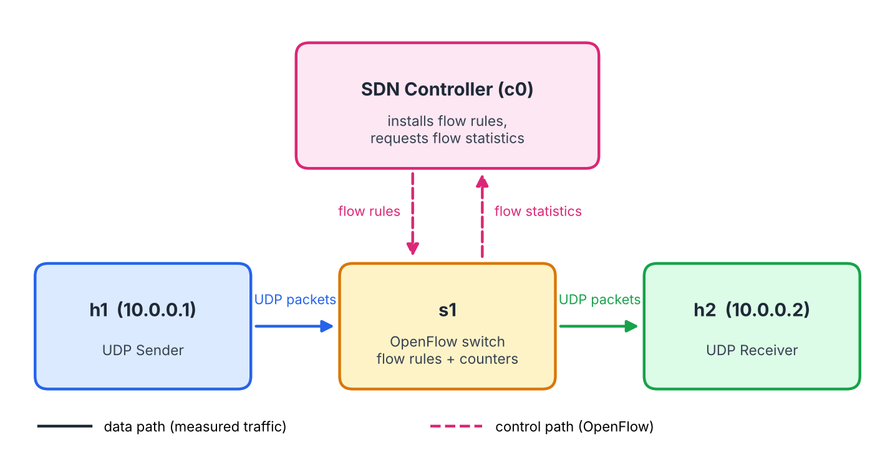
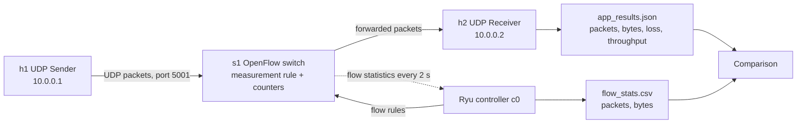

# Bandwidth Meter and Traffic Analyzer

**SDN-Socket Programming (Jackfruit) Mini Project | Topic 26 | Protocol: UDP**
Computer Networks, PES University

## Team

| Member | Name | SRN |
|---|---|---|
| Person 1 | Harsh Vardhan Lohia | PES1UG25CS199 |
| Person 2 | Gyanesh JN | PES1UG25CS189 |
| Person 3 | Kashika B | PES1UG25CS244 |

---

## 1. Problem Understanding

### 1.1 Problem Statement

The assigned problem is to develop a UDP-based traffic measurement application and compare its application-level bandwidth measurements with SDN flow statistics.

In simple terms, the same stream of traffic can be measured from two different places:

- **By the application (host side):** the sender counts what it transmits and the receiver counts what it receives.
- **By the network (switch side):** the SDN switch keeps its own counters for the traffic passing through it, and the SDN controller can read them.

This project generates UDP traffic, measures it both ways, and compares the two sets of results.

### 1.2 Objectives

1. Generate UDP measurement traffic.
2. Count transmitted packets.
3. Count received packets.
4. Calculate throughput.
5. Collect SDN flow statistics.
6. Measure packet loss.
7. Compare application and network measurements.

---

## 2. System Architecture

### 2.1 Components

| Component | Role |
|---|---|
| **UDP Sender (h1)** | Generates numbered UDP packets at a configured rate and size, and counts transmitted packets and bytes. |
| **UDP Receiver (h2)** | Receives packets, counts them, uses sequence numbers to detect losses, and computes throughput and packet loss. |
| **OpenFlow Switch (s1)** | Forwards traffic between hosts following the controller's flow rules, and keeps packet and byte counters per flow rule. |
| **SDN Controller (c0)** | Ryu-based controller that installs flow rules on the switch, recognises the UDP measurement flow, and periodically requests flow statistics. |
| **Results files** | The receiver writes the application results (`/tmp/app_results.json`) and the controller writes the flow statistics (`network/results/flow_stats.csv`). In Deliverable 1 these are checked against each other by hand (test A6); an automated comparison module is planned for Deliverable 2. |
| **Mininet Topology** | Creates the hosts, switch and links, and connects the switch to the controller. |

### 2.2 Topology

```
                  +----------------------+
                  |  SDN Controller (c0) |
                  +----------------------+
                     |                ^
              flow rules        flow statistics
                     v                |
 +--------------+   UDP    +------------------+   UDP    +--------------+
 |  h1          | -------> |  s1              | -------> |  h2          |
 |  10.0.0.1    | packets  |  OpenFlow switch | packets  |  10.0.0.2    |
 |  UDP Sender  |          |  flow counters   |          |  UDP Receiver|
 +--------------+          +------------------+          +--------------+
```

| Host | IP Address | Role |
|---|---|---|
| h1 | 10.0.0.1 | UDP sender |
| h2 | 10.0.0.2 | UDP receiver |

### 2.3 Communication Flow

1. The Ryu controller starts and listens on port 6653.
2. Mininet starts, s1 connects to the controller, and the controller installs two rules: a table-miss rule (send unknown traffic to the controller) and a measurement rule (UDP from 10.0.0.1 to 10.0.0.2 on port 5001, forward to h2, with counters).
3. ARP and ping packets reach the controller through the table-miss rule. It learns MAC addresses and installs forwarding rules so the hosts can reach each other.
4. The receiver on h2 starts and listens on UDP port 5001.
5. The sender on h1 transmits numbered packets. They match the measurement rule, so the switch forwards them directly and increments the packet and byte counters. The controller is not involved per packet.
6. The controller requests flow statistics every 2 seconds and records them in `flow_stats.csv`.
7. The sender finishes with 5 end-marker packets. Both applications print their totals.
8. The application results and the switch counters are compared (manually in Deliverable 1, automatically in Deliverable 2).

### 2.4 Packet Format

| Field | Description |
|---|---|
| Sequence number (4 bytes) | Lets the receiver detect lost packets. |
| Padding | Fills the packet to the configured size. |
| End marker | A final packet carrying the total number sent, so the receiver knows the expected total. It is sent 5 times in case UDP loses it. |

### 2.5 Metrics Measured

| Metric | Application Side | Network Side |
|---|---|---|
| Packets | Counted by sender and receiver | Switch flow-rule packet counter |
| Bytes | Payload bytes counted by the application | Switch byte counter, which includes Ethernet, IP and UDP headers |
| Throughput | Received bytes divided by time between first and last packet | Switch bytes divided by the measurement interval |
| Packet loss | Packets sent minus packets received | Switch packet count minus 5 end markers, compared with the receiver's received count. This shows packets lost after the switch. |

---

### 2.6 Architecture Diagram





## 3. Expected Network Behaviour

- Hosts can reach each other through the switch once the controller has installed forwarding rules.
- ARP and ping packets are handled by the controller, which learns MAC addresses and installs forwarding rules. The UDP measurement flow matches the pre-installed measurement rule from its very first datagram, so the switch forwards and counts it directly.
- The packet count seen by the switch should equal the application's packet count plus 5, because the sender transmits 5 copies of the end marker that the application does not count as data (for example 1000 data packets give 1005 on the switch).
- **The network byte count will be larger than the application byte count.** Each packet carries about 42 bytes of headers (14 Ethernet, 20 IP, 8 UDP) that the application does not count. Throughput figures will also differ slightly, because the headers add bytes and the two measurement time windows differ.
- Under normal conditions in this setup, little or no packet loss is expected. Loss detection is verified with a deliberate test setting that drops a fraction of packets at the receiver.

---

## 4. Team Responsibilities

| Member | Responsibility |
|---|---|
| Harsh Vardhan Lohia (PES1UG25CS199) | UDP sender and receiver; application-side measurements. |
| Gyanesh JN (PES1UG25CS189) | Mininet topology, SDN controller, flow rules and flow statistics. |
| Kashika B (PES1UG25CS244) | Integration and comparison; architecture document; end-to-end tests and demonstration. |

All three members contributed to the design and test cases.
